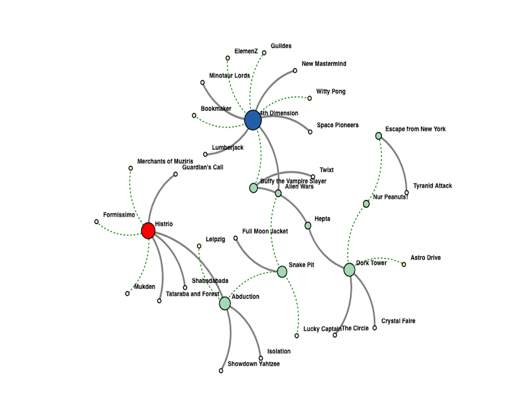
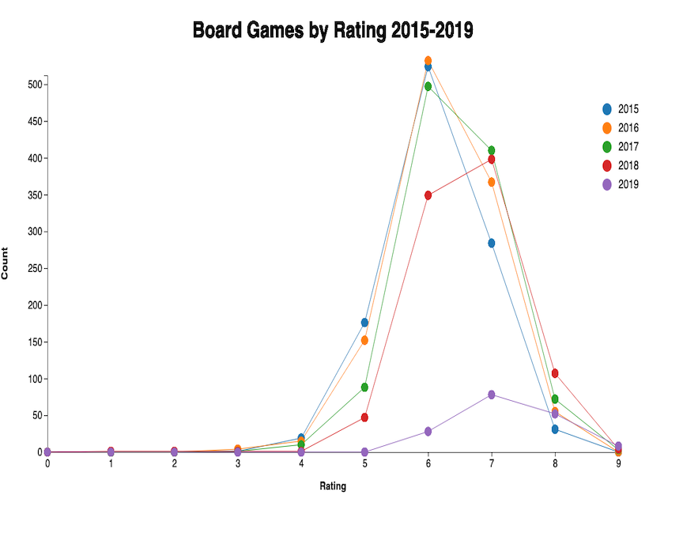
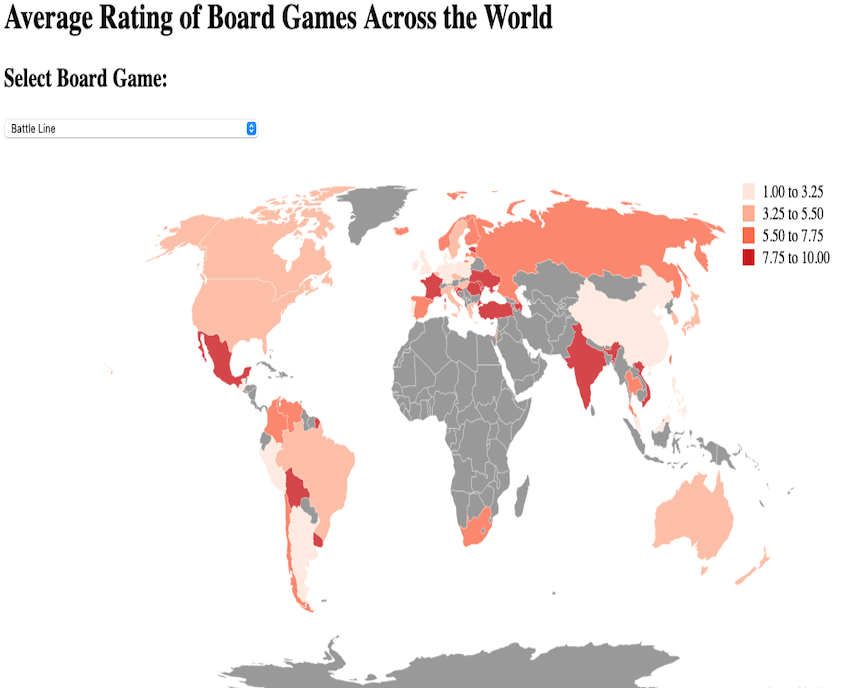

<!--
*** Thanks for checking out the Best-README-Template. If you have a suggestion
*** that would make this better, please fork the repo and create a pull request
*** or simply open an issue with the tag "enhancement".
*** Thanks again! Now go create something AMAZING! :D
-->

<!-- PROJECT SHIELDS -->
<!--
*** I'm using markdown "reference style" links for readability.
*** Reference links are enclosed in brackets [ ] instead of parentheses ( ).
*** See the bottom of this document for the declaration of the reference variables
*** for contributors-url, forks-url, etc. This is an optional, concise syntax you may use.
*** https://www.markdownguide.org/basic-syntax/#reference-style-links
-->

[![MIT License][license-shield]][license-url]
[![LinkedIn][linkedin-shield]][linkedin-url]

<!-- PROJECT LOGO -->
 

  

  <h3 align="center">Board Game Analysis</h3>

  

    Analyzing Board Game Data while Practicing Data Visualization and Interactive Graphs

  

<!-- TABLE OF CONTENTS -->

  
Table of Contents

  <ol>
    <li>
      <a href="#about-the-project">About The Project</a>
      <ul>
        <li><a href="#built-with">Built With</a></li>
      </ul>
    </li>
    <li>
      <a href="#getting-started">Interactive Demos</a>
      <ul>
        <li><a href="#prerequisites">Network Graph</a></li>
        <li><a href="#installation">Stacked Line Graphs</a></li>
        <li><a href="#installation">Choropleth Map</a></li>
      </ul>
    </li>
    <li><a href="#license">License</a></li>
    <li><a href="#contact">Contact</a></li>
  </ol>

<!-- ABOUT THE PROJECT -->
## About The Project

My family is extremely competitive and loves to play board games. I wanted to work on some of my interactive data visualization skills and decided to use board game data as inspiration. These graphs illustrate various ways in whcih data can be analyzed, presented, and shared!

This repo is the source code for the interactive graphs. If you wish to run locally, you will need to run a local host server in the local folder location of where you have downloaded this code. 

* For instructions on how to run locally, click [here] (https://developer.mozilla.org/en-US/docs/Learn/Common_questions/set_up_a_local_testing_server)

### Built With

* [D3](https://d3js.org/)
* HTML
* CSS
* JS

<!-- GETTING STARTED -->
## Interactive Demos

### Network Graph

  

  <a href="https://anna-koretchko.ue.r.appspot.com/graph">
    <Click here for interactive Demo>
  </a>

  

      Click <a href="https://anna-koretchko.ue.r.appspot.com/graph">here</a> for interative demo!
  

### Stacked Line Graphs

  

  

      Click <a href="https://anna-koretchko.ue.r.appspot.com/interactive">here</a> for interative demo!
  

### Choropleth Map

  

  

      Click <a href="https://anna-koretchko.ue.r.appspot.com/choropleth">here</a> for interative demo!
  

<!-- LICENSE -->
## License

Distributed under the MIT License. See `LICENSE` for more information.

<!-- CONTACT -->
## Contact

* Anna Koretchko - [Personal Website](https://anna-koretchko.ue.r.appspot.com/index)
* Email - annakoretchko@gmail.com

<!-- MARKDOWN LINKS & IMAGES -->
<!-- https://www.markdownguide.org/basic-syntax/#reference-style-links -->
[contributors-shield]: https://img.shields.io/github/contributors/othneildrew/Best-README-Template.svg?style=for-the-badge
[contributors-url]: https://github.com/othneildrew/Best-README-Template/graphs/contributors
[forks-shield]: https://img.shields.io/github/forks/othneildrew/Best-README-Template.svg?style=for-the-badge
[forks-url]: https://github.com/othneildrew/Best-README-Template/network/members
[stars-shield]: https://img.shields.io/github/stars/othneildrew/Best-README-Template.svg?style=for-the-badge
[stars-url]: https://github.com/othneildrew/Best-README-Template/stargazers
[issues-shield]: https://img.shields.io/github/issues/othneildrew/Best-README-Template.svg?style=for-the-badge
[issues-url]: https://github.com/othneildrew/Best-README-Template/issues
[license-shield]: https://img.shields.io/github/license/othneildrew/Best-README-Template.svg?style=for-the-badge
[license-url]: https://github.com/annakoretchko/garmin_analysis/blob/master/LICENSE
[linkedin-shield]: https://img.shields.io/badge/-LinkedIn-black.svg?style=for-the-badge&logo=linkedin&colorB=555
[linkedin-url]: https://www.linkedin.com/in/anna-koretchko-1b5b0211a/
[product-screenshot]: images/screenshot.png

